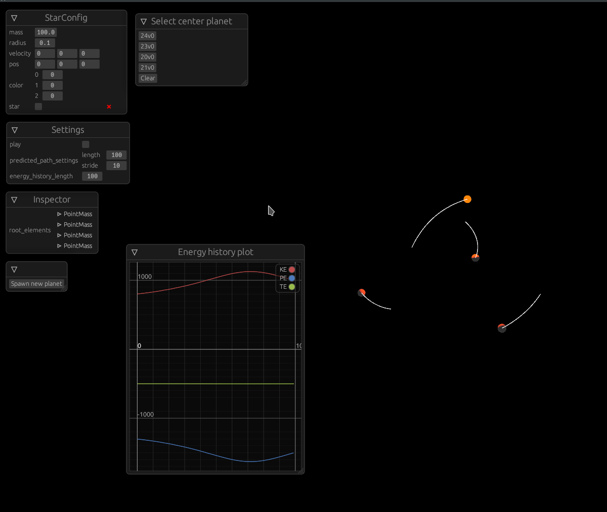

# Simple n-body simulation 


## Movement
W/A/S/D => Forward/Left/Back/Right
Shift/Space => Down/Up
Right click => pan
Scroll => Move closer or farther away from focus point
Escape => Close the window

## Running
A discription of an n-body system must be given as the first arugment
Example:
```bash
cargo run circle.json
```

## TODO 
- [ ] see preview of effect new body would have along with a toggle button to turn the preview off
- [ ] improve menu for adding new body
- [ ] add option to safe current state of the system
- [ ] allow the selection of different numerical integration 
- [ ] implement Chin-Chen 4A, 4B' and 4C family of integration methods
  - [Forward Symplectic Integrators for Solving Gravitational Few-Body Problems](https://www.researchgate.net/publication/1931127_Forward_Symplectic_Integrators_for_Solving_Gravitational_Few-Body_Problems)
    - Equation 28 
- [ ] give them all names and stuff
